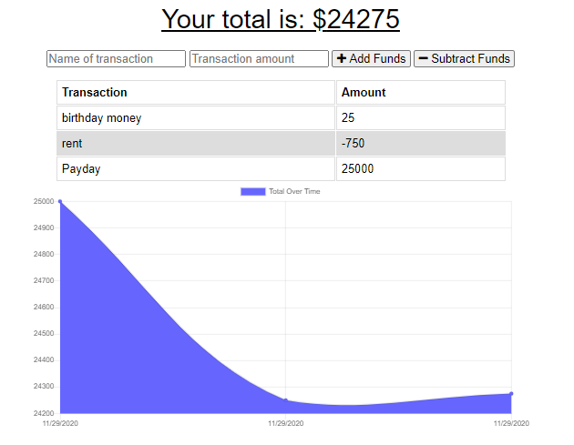

# Fitness Log

 

As an avid traveler, I want to be able to add expenses and deposits to my travel budget with or without a connection. When entering transactions offline, I am able to populate/calculate the total when brought back online.
    With this app I am able to enter deposits, and expenses online and offline and when I am able to find connectivity the offline entries are added to the travel budget. 
## Table of Contents
        
- [Technologies](#technologies)
- [Installation](#installation)
- [Usage](#usage)
- [Credits](#credits)
- [License](#license)
- [Questions](#questions)

### Technologies
    
The technologies utilized in this application are as follows: MongoDB (database), Mongoose, and Heroku . 
- MongoDB is used because this database works as persistent storage of your workouts.
- Mongoose is an ORM/ODM that works alongside MongoDB to translate the MongoDB code and objects in JS.
 
    
### Installation
    
This application is deployed to Heroku [link](https://calm-journey-26270.herokuapp.com/)

### Usage
    
The purpose of this program is to solve the problem of keeping track of your travel budget no matter the wifi connectivity.

    
### Credits
    
The Dev community prides itself in the open source culture that it celebrates and maintains. This application couldn't have been made possible without the help of
- Anthony Zachry for his undefined. [Anthony Zachry](https://www.linkedin.com/in/anthony-zachry-3464b551/)
- Chris Zarlengo for his undefined. [Chris Zarlengo](https://www.linkedin.com/in/zarlengo/)

    
#### Thank You!
    
    
### License
Licensed under the MIT license. 

### Questions
All questions and comments are welcome! Please contact me at joanna.tanveer@gmail.com	 or visit my [Github Profile](https://github.com/JoannaTanveer).

